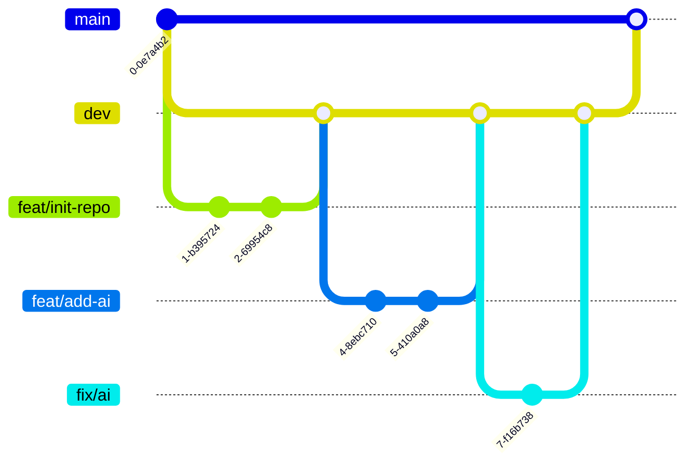

# Contributing

Please read this document before if you plan on seriously contributing to the project. Thanks fellow developer! 😁

## Project Structure

The code of this repo is split in 2 folders:

-   api/ manages the server. It contains a server which differentiate REST requests from HTTP file requests, and so
    return either files or REST responses accordingly.
-   front/ contains static files that should be returned by the HTTP server mentioned earlier.

## Setting Up your Environment

### Install Node.js

You can download Node.js [here](https://nodejs.org/en/download/).

### Install Dependencies

Run `npm install` in the root folder of the project.

### Running the Project

Run `npm start` in the root folder of the project. This will start the server, you will then be able to access it at http://localhost:8000.

## Building the Project

This project uses docker to build the project. You can build the project by running `docker build -t ghcr.io/polytechns/ps8-24-snk-ridor:latest .` in the root folder of the project.

Then, you can run the project by running `docker run -p 8000:8000 ghcr.io/polytechns/ps8-24-snk-ridor:latest`.

If you wish to run the project without building it, simply pull the image from the GitHub Container Registry by running `docker pull ghcr.io/polytechns/ps8-24-snk-ridor:latest` before running the docker run command.

## Commit Message Convention

We use the [Conventional Commits](https://www.conventionalcommits.org/en/v1.0.0/) commit message convention.

Here is what a commit message should look like:

```
<type>[optional scope]: <description>

Ref #<issue number>
```

You can choose between the following types:

-   `feat`: A new feature
-   `fix`: A bug fix
-   `docs`: Documentation only changes
-   `style`: Changes that do not affect the meaning of the code (white-space, formatting, missing semi-colons, etc)
-   `refactor`: A code change that neither fixes a bug nor adds a feature
-   `perf`: A code change that improves performance
-   `test`: Adding missing tests or correcting existing tests
-   `build`: Changes that affect the build system or external dependencies (example scopes: gulp, broccoli, npm)
-   `ci`: Changes to our CI configuration files and scripts (example scopes: Travis, Circle, BrowserStack, SauceLabs)
-   `chore`: Other changes that don't modify src or test files
-   `revert`: Reverts a previous commit

The optional scope can be anything specifying the place of the commit change. For example `ai`, `ui`, `server`, `client`, etc.

The description should be a short description of the change.

### Working Together

If you write code with someone else, this someone else should be added to the commit message as a co-author.

Simply add this to the bottom of the commit message:

```
Co-authored-by: <name> <email>
```

## Branching Strategy

We use the [Gitflow Workflow](https://www.atlassian.com/git/tutorials/comparing-workflows/gitflow-workflow) branching strategy.

Here is a small reminder of the different branches:


